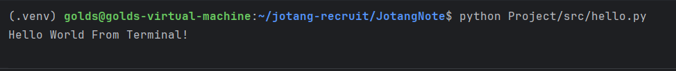
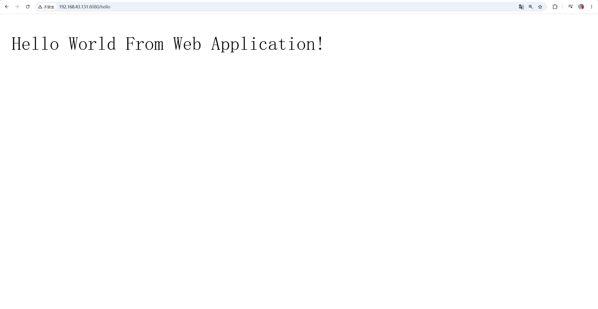

# Part 1 开发环境

## 1. 技术选择

本次后端招新选择使用 Python。

选择 Python 的主要原因是本学期选修课程也会使用 Python，学习内容可以相互衔接；同时 Python 语法相对简单，比较适合先把后端开发的基本流程和逻辑跑通。

## 2. 开发环境

本次开发主要在 Ubuntu 虚拟机中完成，使用 PyCharm Remote Development / SSH 连接虚拟机进行开发。

当前环境：

- Python 3.10.12
- 项目级虚拟环境：`.venv`
- Web 框架：FastAPI
- ASGI Server：Uvicorn

项目中的 Python 环境使用独立的 `.venv`，可以把当前项目需要的依赖和系统 Python 环境分开，避免不同项目之间的依赖相互影响。

## 3. Terminal Hello World

首先编写一个最简单的 Python 程序，在终端中输出：

```text
Hello World From Terminal!
```

运行结果：



## 4. FastAPI Hello World

随后使用 FastAPI 创建一个最简单的 Web 接口。

FastAPI 主要负责定义和处理接口，Uvicorn 负责把 Web 服务真正运行起来并监听请求。

本次实现了：

```text
GET /hello
```

访问：

```text
http://<虚拟机地址>:8080/hello
```

浏览器会显示：

```text
Hello World From Web Application!
```

浏览器访问 `/hello` 后，FastAPI 会根据路由找到对应的 `hello()` 函数并执行。该接口返回的是纯文本响应，因此浏览器最终显示对应内容。

运行 Uvicorn 时使用：

```bash
uvicorn app:app --host 0.0.0.0 --port 8080
```

其中：

- `uvicorn`：启动 Uvicorn 服务。
- `app:app`：表示加载 `app.py` 文件中的 `app` FastAPI 对象。
- `--host 0.0.0.0`：允许从虚拟机外部访问该服务。
- `--port 8080`：让服务监听 8080 端口。

浏览器运行结果：


